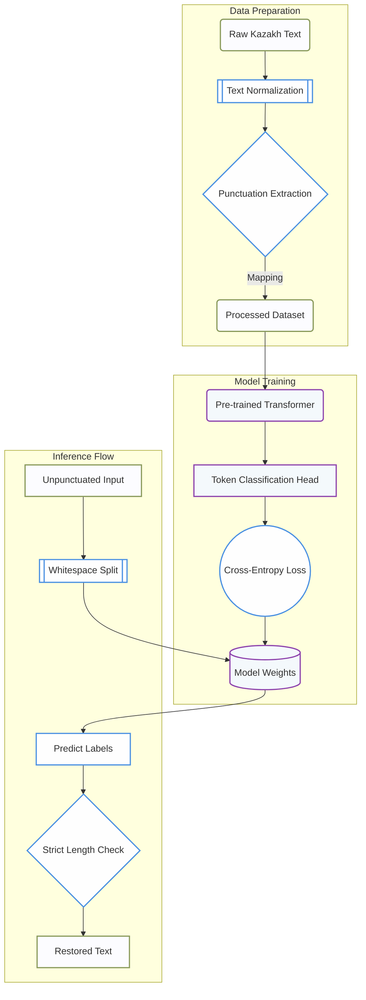

<div align="center">
  
# 🇰🇿 Kazakh Punctuation Restoration
**Robust NLP Pipeline for Post-ASR Text Formatting**

[](https://www.python.org/downloads/)
[](https://pytorch.org/)
[](https://huggingface.co/)
[](https://opensource.org/licenses/MIT)

</div>

## Overview
Punctuation carries meaning—it marks where sentences end, where pauses belong, and whether something is a statement or a question. Without it, text output from Automatic Speech Recognition (ASR) systems is largely unreadable and hard for downstream NLP tasks to process.

This project implements a **Token Classification model** designed to restore missing punctuation in raw, lowercased Kazakh text. Given a sequence of punctuation-stripped Kazakh words, the model predicts the exact punctuation mark that should follow each word.

## ML Pipeline Architecture

The end-to-end architecture demonstrates how raw, diverse domain data is collected, preprocessed, inferred, and evaluated to meet the strict whitespace-split token-matching requirements.



## Task Details & Labels

This is framed as a **Token Classification** problem. For each whitespace-separated word in the input, the model predicts one of four labels:

| Label | Meaning | Example |
| :--- | :--- | :--- |
| **`O`** | No punctuation follows | `most words` |
| **`COMMA`** | Comma follows | `сәлем` → `сәлем,` |
| **`PERIOD`** | Period/Sentence boundary follows | `Бахыт` → `Бахыт.` |
| **`QUESTION`** | Question mark follows | `қалай` → `қалай?` |

*(Note: Exclamation marks (`!`) are structurally mapped to `PERIOD` as sentence boundaries).*

## Evaluation Metric

The primary evaluation metric is **Macro F1-Score** over the three punctuation classes (`COMMA`, `PERIOD`, `QUESTION`).

- **Class `O` is completely excluded** from the final score calculation because it is the dominant, trivially easy class (~85% of standard text).
- The final score is the unweighted average of F1 scores across the three target punctuation classes, meaning rare classes heavily impact the final model performance.

## Dataset

Since only a small sample dataset (500 rows) was provided initially, a major component of this pipeline was generating a robust, diverse training corpus.

**Where to get the data:**
The final pre-processed dataset (developed for this competition) is uploaded directly to Kaggle. You do not need to generate the data from scratch.

🔗 **[Kazakh Punctuation Dataset (Kaggle)](https://www.kaggle.com/datasets/dilyarace/kazakh-punct-data/data)**

**How to download using Kaggle CLI:**
```bash
kaggle datasets download -d dilyarace/kazakh-punct-data
unzip kazakh-punct-data.zip -d data/
```

> **Note:** The `data/` folder is ignored in Git (`.gitignore`) because dataset files are too large for GitHub. You must create the `data/` folder locally and place the downloaded files there before running the code.

## Quick Start / Reproduction

### Prerequisites
Make sure you have Python 3.8+ installed. Install the dependencies via:
```bash
pip install -r requirements.txt
```

### Data Preparation
Download the dataset from Kaggle (link in the Dataset section above) and place all `.csv` files inside a directory named `data/` in the root of the project.

```bash
mkdir data
# Place train.csv, test.csv, etc. here
```

### Training
Fine-tune the chosen transformer on your newly generated dataset:
```bash
python scripts/train.py --config configs/train_config.yaml
```

### Inference & Validation
To predict on an unpunctuated test set (e.g., `test.csv`):
```bash
python scripts/inference.py --model_path checkpoints/best_model --test_file data/test.csv --output my_submission.csv
```
> **⚠️ Critical Step:** The inference script includes an automatic assertion step to ensure strictly identical token-to-label length matching, preventing subtle padding/truncation errors down the line.

## Contribution & Hackathon Rules
- **No Manual Labelling:** The test predictions must be purely generated by the trained model (zero manual overriding).
- **No Direct LLM Inference:** Commercial API solutions (OpenAI, Claude, etc.) cannot be used directly on the test set for final predictions.
- **Reproducibility:** A reproducible pipeline in a Kaggle Notebook or scripts form must accompany the final submission.

## License
This project is released under the [MIT License](LICENSE).
